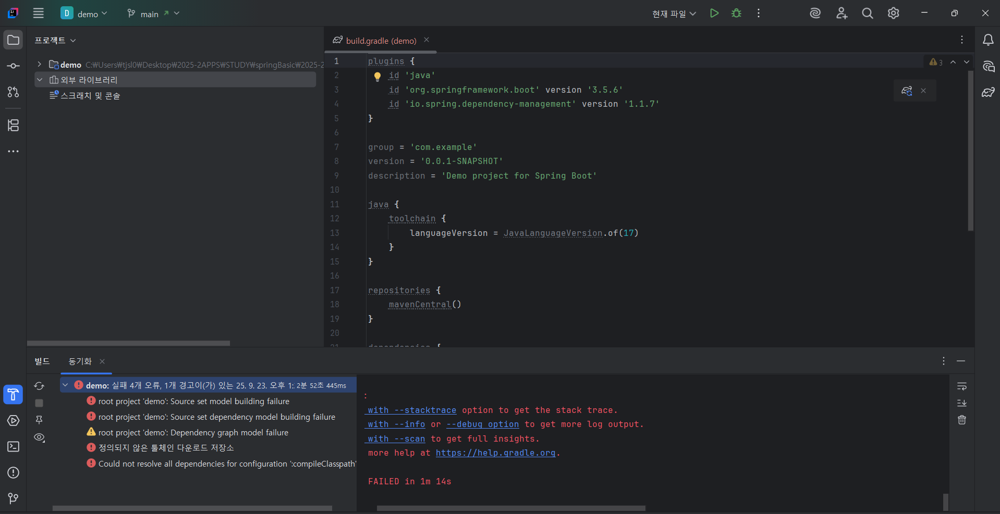
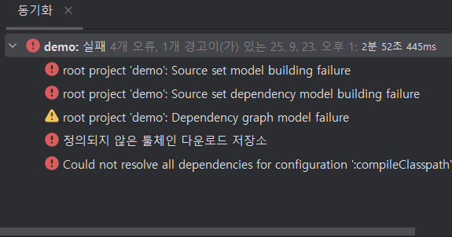
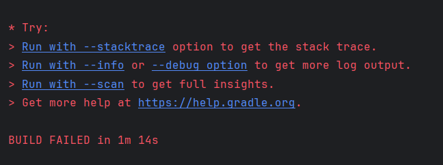
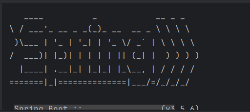

## 백엔드 개발자란?
### 웹 구현 방법
#### 과거
- 과거 웹은 정보 조회 목적 -> 모든 걸 하나하나 만듦.
- 점점 정보 수정, 삽입 등 목적 다양화 -> 데이터가 패턴 띔 -> 화면 개발과 로직 개발, 데이터 연산 개발 등 역할 분리 

#### 현재
화면 개발 -> 프론트엔드
로직 및 데이터 연산 -> 백엔드

### 백엔드 개발자와 API
`내 생각: API는 통신 규약. 어떤 데이터를 어떤 방식으로 통신하는지를 정리한 규약 문서이다. 하지만 아직 구체적으로 어떤 문서인건지, 안 지키면 어떻게 되는 건지는 모른다.`
#### API
- application programming interface(서로 마주하다)
- 예) 공공데이터 포털 오픈 API -> 데이터 제공
##### 왜 생겼는가?
    원래: 데이터에 바로 접근할 수 있도록
    -> 보안 취약. 데이터 변형 가능성 높음. 데이터 너무 방대해 이용성 저하.
    그래서...
    위험하지 않은 한도 내에서 원하는 부분만 요청할 수 있게 요청 방법을 알려줌. = 인터페이스
    


#### REST API
* 너무 많은 내용 그래서 간단히 배울 것.
- HTTP(인터넷 세상에서 지켜야하는 약속)를 잘 지키는 API
#### RESTful API
- HTTP를 너~~무 잘 지킨 API

## 실습 준비
### 툴
- intelliJ
- community ver: spring boot 에 서버 생성 기능이 내장되어 있기에 서버 생성 기능이 없는 ver이지만 괜찮음.
### 스프링 부트 생성
- 프로젝트 기반 마련
- https : 여기서 s란 secure, 즉, 보안이 좀 더 강화된 버전.
#### project 
- 빌드 도구: 소스코드를 실행시키는 도구, 프로젝트 생성도 도움
- gradle : 가장 최신식 (빌드 도구와 소통하는 언어: groovy/kotlin)
- maven
- ant
#### language
- java
#### Spring Boot
- SNAPSHOT: 에러 존재 가능성 높음.
#### 메타데이터
- project 설명 데이터, 이름 등
- Packaging: 배포할 때의 압축 언어(Jar: 자바 아카이브, War: 웹 아카이브)
- Java ver: 17(가장 안정화)
#### Dependencies : 의존성 = 사용성
- spring web

이제 generate하고, 압축을 풀고, build.gradle을 열고 설치를 기다리면 된다.

## 설치 오류 발생 및 해결과정
### 개요




빨갛게 보이는 build failed 글자...

` * What went wrong:
Could not resolve all dependencies for configuration ':compileClasspath'.
Failed to calculate the value of task ':compileJava' property 'javaCompiler'.
Cannot find a Java installation on your machine (Windows 11 10.0 amd64) matching: {languageVersion=17, vendor=any vendor, implementation=vendor-specific, nativeImageCapable=false}. Toolchain download repositories have not been configured.`

라고한다.
내 생각엔, 내 노트북에 java 17이 없다고 하는 듯하다. 우선 구글에게도 내 생각이 맞는지 물어보자.
### 해결 과정
오, 같은 문제를 해결한 블로그 글이 있다.
[https://velog.io/@heejae-l/Spring-Boot-%ED%94%84%EB%A1%9C%EC%A0%9D%ED%8A%B8-%EC%83%9D%EC%84%B1-%EC%98%A4%EB%A5%98-%ED%95%B4%EA%B2%B0]

내가 생각했던 대로, java 17 ver이 내 컴퓨터에 없다는 문제였다. java 24가 깔려있으나 이 둘이 호환되지 않는다는 것을 배웠다.

그럼 jdk 17을 다운받아야한다. 터미널 명령어를 알아보니 `winget`이라는 윈도우 패키지 관리자(Windows Package Manager, WinGet)를 이용하면 된다고 한다.
`winget install Microsoft.OpenJDK.17`를 이용해 다운받아주었다.
그리고 해당 버전을 이용하도록 설정을 변경해주면 된다.
참고 [https://hermeslog.tistory.com/787]

## 프로젝트 구조
### .gradle
gradle이 쓰는 캐쉬 파일(임시 저장) 존재. 내가 건드릴 일은 없을 듯하다.
### build
프로젝트 실행 준비를 위한 폴더
### src
#### main
##### java
- DemoApplication : 메인 메소드 준비되어 있음.
##### resource
- 이미지, 화면, JPA(스프링이랑 데이터베이스 연동)
#### test: TDD 방법론 적용

#### build.gradle
- 빌드에 중요한 건 여기에 적힘.
- dependencies: 내가 추가한 의존성

#### setting.gradle
gradle 이 설정할 내용들 등

### External Libraries: 외부 라이브러리

## 프로젝트 실행 확인

잘 돌아간다!

## 인터페이스와 추상클래스 차이
### 탐구 동기
영상 강의에서 API의 인터페이스를 설명하시면서 자바의 인터페이스와 추상 클래스의 차이를 알면 좋겠다고 하셨다. 막상 생각해보니 어? 그렇네? 차이가 뭐지? 아니, 이 둘이 정확히 무엇이지? 하는 궁금증이 들어 이를 찾아보게 되었다.
### 추상화
이 두 개념의 상위 개념부터 찾아보았다. 추상 클래스라는 이름에서도 엿볼 수 있듯이 이 두 개념은 객체 지향 프로그래밍의 4대 핵심 원칙 추상화를 기반으로 한다.
그렇다면, 추상화는 정확히 어떤 것인가?
- 예: 자동차의 구조를 몰라도 핸들, 기어, 브레이크와 악셀만 알면 운전 가능.

- 복잡한 내부 구현은 숨기고 사용에 필요한 핵심적인 기능만 외부에 노출하는 것
- 목적: 코드의 복잡성 완화, 유지보수성 강화
- 구현 방법: 미완성 설계도(인터페이스와 추상클래스)를 하위클래스가 구체적으로 구현
#### 내부 구현과 노출할 영역 구분
외부 호출자의 관점(이 객체를 사용하는 코드/개발자가 알아야할 정보는?). 즉, 핵심 기능 = 객체가 무엇을 할 수 있는가?/ 내부 구현 = 그것을 어떻게 하는가?

- 핵심 기능
외부로 공개되어 다른 코드와 상호작용하는 부분
예) 상태 변경, 조회, 목적이 되는 기능(Calculator의 add())
이 기능은 내부 구현이 바뀌어도 사용법과 동작 결과는 유지되어야 함!

- 내부 구현
클래스 내부에서만 사용되는 세부적 과정, 데이터
예) 동작 방식, 자료구조, 최적화 로직 등
자주 변경될 수 있는 부분이 여기에 해당

### 인터페이스 
특정 객체가 수행해야 할 행동의 명세 및 계약을 정의
O: '무엇을' 할 수 있는지 
X: '어떻게(How)' 수행할지에 대한 구체적인 구현

예) 리모컨의 버튼(기능 명시)-> 인터페이스/ 리모컨 버튼 누른 후 돌아가는 동작 구현 -> 클래스로 인터페이스 구현 

- 목적: 클래스의 특정 역할 수행 보장, 관련없는 클래스들에게 공통된 행동 부여
    * -able 형태 이름이 많음
- 구성 요소: 추상 메서드(내용 없음), 상수, default/static을 통한 간단한 구현
- 구현: implements 키워드 사용, 한 클래스가 여러개의 인터페이스를 동시 구현 가능
    * 인터페이스 만으로는 객체 생성 불가능

```java
// 날 수 있다는 '행동의 계약'을 정의하는 인터페이스
interface Flyable {
    void fly(); // 이 인터페이스를 구현하는 클래스는 반드시 fly() 메서드를 구현해야 함
}

// Bird 클래스는 Flyable 인터페이스를 구현(implements)
class Bird implements Flyable {
    @Override
    public void fly() {
        System.out.println("새가 날개로 하늘을 납니다."); // '어떻게' 날 것인지 구체적으로 구현
    }
}

// Drone 클래스 또한 Flyable 인터페이스를 구현
class Drone implements Flyable {
    @Override
    public void fly() {
        System.out.println("드론이 프로펠러를 돌려 비행합니다."); // '어떻게' 날 것인지 구체적으로 구현
    }
}
```

### 추상 클래스
여러 클래스 간의 공통적인 특징(필드와 메서드) 추출

예) 자동차의 기본 설계도: 바퀴, 핸들, 차체(공통적) -> 구현에서 색상 등을 결정 

- 목적: 밀접한 연관 클래스 간에 공통적 코드를 공유, 상속 관계를 명확히 함.
- 구성: 일반적 멤버 변수, 구현이 완료된 일반 메서드, 구현이 필요한 추상 메서드 모두 가능
- 상속: expends, 단일 상속만 허용되므로(in java) 하나의 추상 클래스만 상속 가능
- 생성자: 객체 생성 불가능, 생성자는 자식 클래스가 객체 생성할 때 부모 클래스의 필드를 초기화하는 데 사용.
```java
// 동물의 공통 특징을 정의하는 '미완성 설계도'인 추상 클래스
abstract class Animal {
    String name;

    // 모든 동물이 공통적으로 가지는, 구현이 완료된 메서드
    public void breathe() {
        System.out.println("숨을 쉽니다.");
    }

    // 자식 클래스가 반드시 직접 구현해야 하는 추상 메서드
    public abstract void makeSound();
}

// Animal 추상 클래스를 상속(extends)받은 Dog 클래스
class Dog extends Animal {
    // 추상 메서드를 '어떻게' 구현할지 구체화
    @Override
    public void makeSound() {
        System.out.println("멍멍!");
    }
}

// Animal 추상 클래스를 상속받은 Cat 클래스
class Cat extends Animal {
    @Override
    public void makeSound() {
        System.out.println("야옹~");
    }
}
```

### 인터페이스와 추상 클래스의 주요 차이점 비교

| | 인터페이스 | 추상 클래스 |
| :--- | :--- | :--- |
| 상속 | 다중 구현 가능| 단일 상속만 가능|
| 목적 | 클래스가 특정 역할을 수행할 수 있음을 보장하는 '행동의 계약'을 정의하는 것. (예) `Runnable`) | 관련성이 높은 클래스들의 공통된 필드와 메서드를 공유하고 확장하기 위함. |
| 필드 (변수) | `public static final`로 정의된 상수만 가능 | `static`, `final`을 포함한 모든 종류의 멤버 변수 가능 |
| 메서드 | 추상 메서드가 기본/ `default` 메서드, `static` 메서드 포함 가능 | 추상 메서드와 구현이 완료된 일반 메서드 모두 가능 |
| 생성자 | X | O, 직접 객체 생성 불가능/ 자식 클래스에서 `super()`로 호출 |
| 접근 제어자 | 모든 멤버는 기본적으로 `public` | `public`, `protected`, `private` 등 다양한 접근 제어자 가능 |

#### 사용 시점

1. 인터페이스를 사용하는 경우
- 서로 **관련 없는** 클래스들에게 공통된 기능을 부여하고 싶을 때 사용. 
- 예) `Bird` 클래스와 `Airplane` 클래스는 상속 관계가 아니지만 `Flyable` 인터페이스를 구현하여 '날 수 있다'는 공통 기능을 가질 수 있다.
- 클래스의 핵심 역할과 별개로 부가적인 기능을 추가하고 싶을 때 적합
- 다중 상속의 이점을 활용해야 할 때 사용
##### 다중 상속의 이점
- 클래스를 통한 다중 상속 시의 문제점: 다이아몬드 문제(A(최상위 클래스)-> B, C 각각 상속받아 재정의(오버라이드)-> D가 B, C 상속 -> 충돌!!!)
- 따라서 구현이 없는, 선언만 있는 인터페이스는 가능~, 구체적인 구현의 의무는 클래스에게 전달되기 때문임.

2. 추상 클래스를 사용하는 경우
- 여러 클래스가 공통된 상태(필드)나 메서드를 공유하며 밀접한 관련이 있을 때 사용. 
- 예) `Shape`라는 추상 클래스 -> 이를 상속받는 `Circle`, `Rectangle` 클래스들은 공통적으로 `color` 필드나 `draw()` 메서드를 공유할 수 있음
- 상속 계층 구조에서 상위 클래스로서의 역할과 정체성을 명확히 하고 싶을 때 적합

## 인타페이스와 API
추상 클래스와 인터페이스를 살펴보며 인터페이스에 대해 이해했다. 그럼 이제 인터페이스와 API를 비교하며 최종적으로 API를 이해해보자.

공통된 의미: 서로 다른 두 주체가 상호작용하기 위한 약속 또는 접점
### API
- 애플리케이션, 소프트웨어 라이브러리, 운영체제 등 두 소프트웨어 구성 요소가 서로 통신할 수 있도록 하는 규칙과 약속의 집합
- 형태: 웹 API(HTTP 요청 규칙), 라이브러리의 public 메서드 목록, 운영체제의 시스템 콜 등 다양한 형태
- 역할: 사용자가 내부의 복잡한 구현을 전혀 몰라도, 정해진 규칙(API)에 맞춰 요청만 보내면 원하는 기능과 결과를 얻을 수 있도록 하는 '소통 창구' 역할

## REST API의 REST
마지막 궁금증! REST의 의미는?
- REpresentational State Transfer
- 소프트웨어 설계 원칙
### 약자 해석
#### Representational (표현)
'자원(Resource)'의 '표현'
자원 = 웹상에서 이름으로 식별할 수 있는 모든 정보(예: 사용자 정보, 게시글, 이미지 등)
REST에서는 이 자원의 실제 데이터가 아니라, 클라이언트가 이해할 수 있는 형태인 JSON이나 XML 등으로 표현된 버전을 사용함. 즉, 서버의 데이터베이스에 있는 원본 데이터를 그대로 보내는 것이 아니라, 그것을 '표현'한 결과물을 보내는 방식.
#### State (상태)
'자원(Resource)'의 '상태'
예) '사용자' -> 자원
그 사용자의 이름, 이메일, 프로필 사진 등의 데이터 -> 자원 '상태'

#### Transfer (전달)
클라이언트와 서버 간의 '전달'. 주로 HTTP 프로토콜 이용

>"자원의 '상태'에 대한 '표현'을 HTTP를 통해 '전달'하는 것"